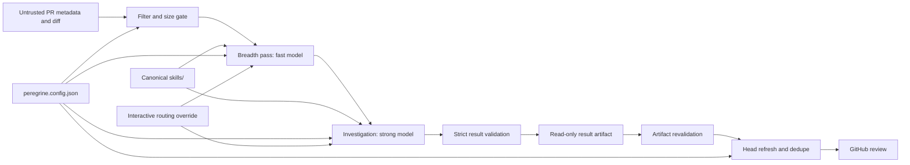

# Architecture

Peregrine has one canonical skill implementation and thin host adapters. Claude and Codex receive the same invariant method, finding contract, review lanes, and project-profile trust rules.

The GitHub repository is also the distribution boundary. `.claude-plugin/marketplace.json` and `.agents/plugins/marketplace.json` expose the root plugin from `main`; native marketplace refresh plus plugin reinstall/update replaces disconnected copied-skill upgrade paths.

## Boundaries

1. **Skills:** `skills/` is the only editable source. `.claude-plugin/` and `.codex-plugin/` package the same directories; installed copies are release artifacts, not sources.
2. **Core:** filtering, prompts, package paths, strict model-output parsing, and normalized `EngineResult` construction are provider-neutral.
3. **Deterministic routing:** the Node runner resolves the trusted profile, executes the bundled review-manifest code before inference, and embeds its output and the filtered diff in both stages. Profile order remains explicit path, merge-base-safe repository profile, then external per-repository profile. Manifest structure is trusted, while repository-derived paths and metadata remain untrusted data. Models do not spend turns rerunning the manifest or reconstructing the changed-file list.
4. **Runners:** Claude and Codex each launch separate breadth and investigation processes with read-only repository access and strict JSON schemas. Per-stage usage and duration are retained as telemetry.
5. **Outbound trust gate:** structured output is reparsed, bounded, checked for credential patterns, and only then persisted or passed to the separate posting process.
6. **Artifact:** `review` writes a normalized result. `post` parses the artifact again and refuses invalid status/finding/usage shapes.
7. **Posting:** GitHub posting refreshes the PR head, applies the confidence threshold and comment cap, deduplicates root-cause fingerprints, validates inline locations against the diff, and falls back once to a body-only review on an inline `422`.
8. **Configuration:** `peregrine.config.json` and provider-scoped environment variables control the automated Node runner. Interactive plugin calls accept only model and effort routing; Claude can persist those four values through plugin `userConfig`, while Codex receives them in the current request. Parent-session turns, budget, and timeout remain host-owned and are never presented as enforceable interactive plugin options.

## Status semantics

- `completed`: one or more validated findings.
- `clean`: the review completed with zero findings.
- `skipped`: the filtered diff exceeded the configured limit and `--deep` was not requested.

Provider failure, timeout, missing output, or invalid JSON is an error. It is never converted into `clean`.

## GitHub job isolation

Automatic and mention workflows use two jobs:

- `analyze` has read-only GitHub permissions and only the selected model credential.
- `post` has pull-request write permission, no model credential, and accepts only the revalidated artifact.

The reviewed repository and Peregrine are sibling checkouts. Diff and result files live in the runner temporary directory, so tooling does not modify the target checkout.
