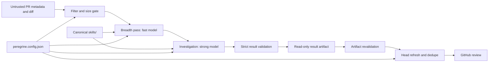

# Architecture

Peregrine has one canonical skill implementation and thin host adapters. Claude and Codex receive the same invariant method, finding contract, review lanes, and project-profile trust rules.

## Boundaries

1. **Skills:** `skills/` is the only editable source. `.claude-plugin/` and `.codex-plugin/` package the same directories; installed copies are release artifacts, not sources.
2. **Core:** filtering, prompts, package paths, strict model-output parsing, and normalized `EngineResult` construction are provider-neutral.
3. **Runners:** Claude defines one bounded breadth worker inside its investigation session. Codex launches separate ephemeral breadth and investigation processes. Both get read-only repository access and strict JSON schemas.
4. **Artifact:** `review` writes a normalized result. `post` parses the artifact again and refuses invalid status/finding/usage shapes.
5. **Posting:** GitHub posting refreshes the PR head, applies the confidence threshold and comment cap, deduplicates root-cause fingerprints, validates inline locations against the diff, and falls back once to a body-only review on an inline `422`.

## Status semantics

- `completed`: one or more validated findings.
- `clean`: the review completed with zero findings.
- `skipped`: the filtered diff exceeded the configured limit and `--deep` was not requested.

Provider failure, timeout, missing output, or invalid JSON is an error. It is never converted into `clean`.

## GitHub job isolation

Automatic and mention workflows use two jobs:

- `analyze` has read-only GitHub permissions and only the selected model credential.
- `post` has pull-request write permission, no model credential, and accepts only the revalidated artifact.

The reviewed repository and Peregrine are sibling checkouts. Diff and result files live in the runner temporary directory, so tooling does not modify the target checkout.
